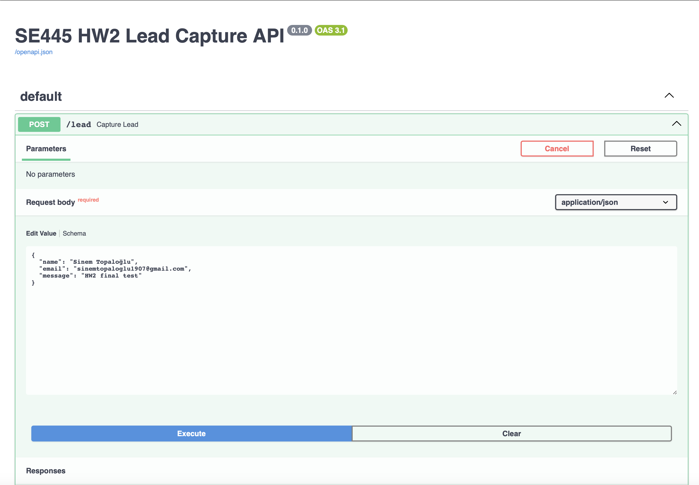
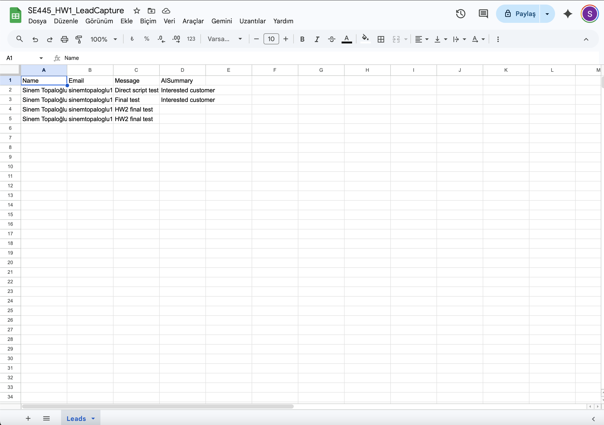

# Lead Capture API – SE445 HW1 and HW2

## 📌 Overview

This project implements a simple lead capture system using FastAPI, Google Apps Script, and Google Sheets. The system collects user data (name, email, message), processes it, generates an AI summary, and stores the data in Google Sheets.

---
## 🧰 Development Environment

This project was developed using Google Antigravity as the main development environment.

---

## ⚙️ Technologies Used

* FastAPI (Python)
* Uvicorn
* Google Apps Script
* Google Sheets
* JSON API

---

## 🔄 Workflow

1. User sends data via POST request to FastAPI endpoint (`/lead`)
2. FastAPI receives and processes the input
3. AI summary is generated from the message
4. Data is sent to Google Apps Script (webhook)
5. Data is stored in Google Sheets

---

## AI Integration

An OpenAI GPT model is used to generate a short summary of the lead message before storing the data in Google Sheets.

---

## 🧠 Logic

The system receives user input (name, email, message), processes the data, generates an AI summary, and sends it to Google Sheets using a webhook integration.

---

## 🚀 API Endpoint

### POST /lead

### Example Request

```json
{
  "name": "Sinem Topaloğlu",
  "email": "sinemtopaloglu1907@gmail.com",
  "message": "I want to know your services"
}
```

---

## ✅ Output

* Data is successfully stored in Google Sheets
* AI summary is generated and saved
* API returns a success response

---

## 🧪 Testing

The API was tested using Swagger UI and successfully verified.

---

## 📷 Screenshots

* Swagger API test
* Terminal output
* Google Sheets data
* Apps Script deployment

(See report document for screenshots)

---

## 🎯 Result

The system successfully captures user data, processes it, and stores it in Google Sheets through a complete workflow.

---
---

## HW2 – Data Input & Persistence

📌 Objective

This homework focuses on capturing raw lead data and storing it directly in Google Sheets without data loss.

⚙️ Requirements Implementation

- A POST endpoint `/lead` is created ✔️  
- The system accepts a JSON payload with exactly three fields: `name`, `email`, and `message` ✔️  
- Data is sent to Google Sheets using a webhook (Google Apps Script connector) ✔️  
- Each request creates a new row in the sheet ✔️  

🔄 HW2 Workflow

HTTP POST Request (`name`, `email`, `message`) → Google Apps Script Connector → Google Sheets
---
🧪 Test Case

```json
{
  "name": "Sinem Topaloğlu",
  "email": "sinemtopaloglu1907@gmail.com",
  "message": "HW2 final test"
}
```
---
✅ Results
The data was successfully stored in Google Sheets
No data loss occurred
No formatting errors were observed
Each field was written into the correct column

📷 Proof
Swagger request and response screenshot
Google Sheets showing the inserted row

🎯 Conclusion
The system successfully receives user input and stores it in Google Sheets in real-time, fulfilling all HW2 requirements.

 📷 HW2 Screenshots
### Swagger Test 
### Google Sheets Result 
