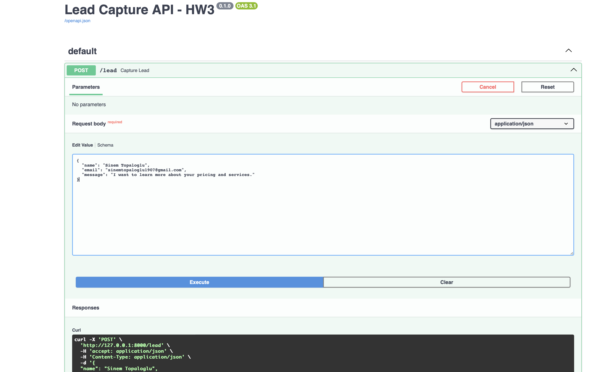
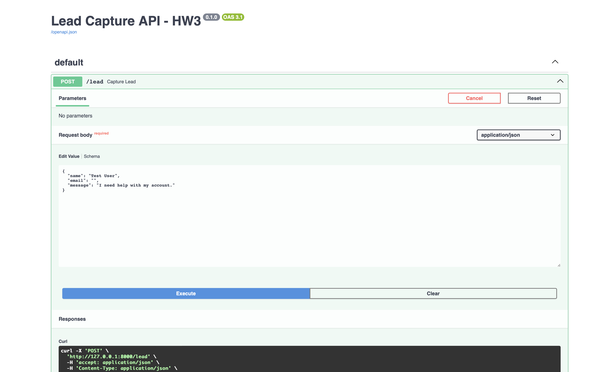
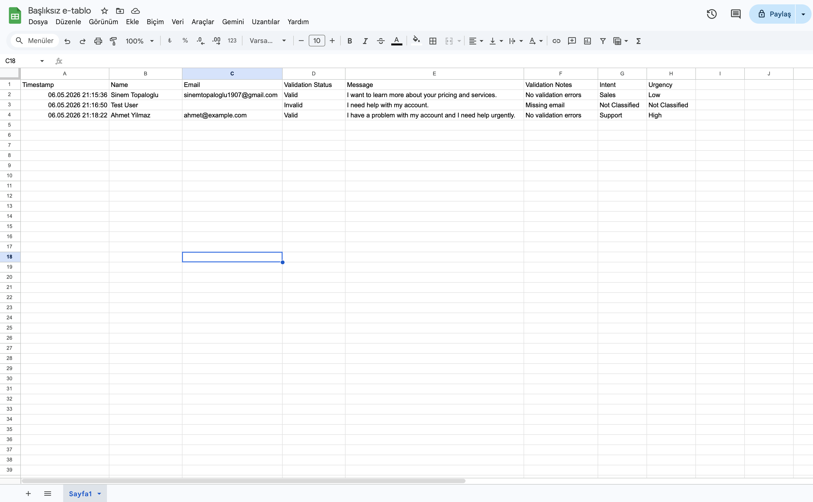

# Lead Capture API – SE445 HW1, HW2 and HW3

## 📌 Overview

This project implements a simple lead capture system using FastAPI, Google Apps Script, and Google Sheets. The system collects user data (name, email, message), processes it, generates an AI summary, and stores the data in Google Sheets.

---
## 🧰 Development Environment

This project was developed using Google Antigravity as the main development environment.

---

## ⚙️ Technologies Used

* FastAPI (Python)
* Uvicorn
* Google Apps Script
* Google Sheets
* JSON API

---

## 🔄 Workflow

1. User sends data via POST request to FastAPI endpoint (`/lead`)
2. FastAPI receives and processes the input
3. AI summary is generated from the message
4. Data is sent to Google Apps Script (webhook)
5. Data is stored in Google Sheets

---
## 🔑 Environment Variable

The OpenAI API key is stored securely using an environment variable.

Example:

```bash
export OPENAI_API_KEY="your_api_key_here"
```
---

## AI Integration

An OpenAI GPT model is used to generate a short summary of the lead message before storing the data in Google Sheets.

---

## 🧠 Logic

The system receives user input (name, email, message), processes the data, generates an AI summary, and sends it to Google Sheets using a webhook integration.

---

## 🚀 API Endpoint

### POST /lead

### Example Request

```json
{
  "name": "Sinem Topaloğlu",
  "email": "sinemtopaloglu1907@gmail.com",
  "message": "I want to know your services"
}
```

---

## ✅ Output

* Data is successfully stored in Google Sheets
* AI summary is generated and saved
* API returns a success response

---

## 🧪 Testing

The API was tested using Swagger UI and successfully verified.

---

## 📷 Screenshots

* Swagger API test
* Terminal output
* Google Sheets data
* Apps Script deployment

(See report document for screenshots)

---

## 🎯 Result

The system successfully captures user data, processes it, and stores it in Google Sheets through a complete workflow.

---
---

## HW2 – Data Input & Persistence

📌 Objective

This homework focuses on capturing raw lead data and storing it directly in Google Sheets without data loss.

⚙️ Requirements Implementation

- A POST endpoint `/lead` is created ✔️  
- The system accepts a JSON payload with exactly three fields: `name`, `email`, and `message` ✔️  
- Data is sent to Google Sheets using a webhook (Google Apps Script connector) ✔️  
- Each request creates a new row in the sheet ✔️  

🔄 HW2 Workflow

HTTP POST Request (`name`, `email`, `message`) → Google Apps Script Connector → Google Sheets
---
🧪 Test Case

```json
{
  "name": "Sinem Topaloğlu",
  "email": "sinemtopaloglu1907@gmail.com",
  "message": "HW2 final test"
}
```
---
✅ Results
The data was successfully stored in Google Sheets
No data loss occurred
No formatting errors were observed
Each field was written into the correct column

📷 Proof
Swagger request and response screenshot
Google Sheets showing the inserted row

🎯 Conclusion
The system successfully receives user input and stores it in Google Sheets in real-time, fulfilling all HW2 requirements.

 📷 HW2 Screenshots
### Swagger Test 
### Google Sheets Result 
---
---

# HW3 – Logic & Intelligent Processing

## 📌 Objective

This homework improves the lead pipeline by adding validation logic and AI-based lead analysis.

The system now validates incoming data, flags invalid leads, classifies lead intent and urgency, and stores all metadata in Google Sheets.

---

## ⚙️ Requirements Implementation

### ✔ Validation Logic

The system checks:

- Missing name
- Missing email
- Invalid email format
- Missing message

Validation results are stored in the sheet.

---

### ✔ Lead Flagging

Invalid leads are NOT discarded.

Instead, the system marks them using:

- Validation Status
- Validation Notes

Example:

- Validation Status: Invalid
- Validation Notes: Missing email
- 
---
  ✔ AI Classification
  
The system analyzes the message content and generates:

- Intent
- Urgency

Supported Intent categories:

- Sales
- Support
- Partnership
- General

Supported Urgency categories:

- High
- Medium
- Low
---

✔ Data Persistence

All processed data is stored in Google Sheets together with metadata.

Stored fields:

- Name
- Email
- Message
- Validation Status
- Validation Notes
- Intent
- Urgency
---

🔄 HW3 Workflow

Input ({name, email, message})
→ Validation
→ AI Classification
→ Google Sheets
---

🧪 Test Cases

Valid Lead Example
{
  "name": "Sinem Topaloglu",
  "email": "sinemtopaloglu1907@gmail.com",
  "message": "I want to learn more about your pricing and services."
}

Result:
Validation Status: Valid
Intent: Sales
Urgency: Low

Invalid Lead Example
{
  "name": "Test User",
  "email": "",
  "message": "I need help with my account."
}

Result:
Validation Status: Invalid
Validation Notes: Missing email
Intent: Not Classified
Urgency: Not Classified

Support Classification Example
{
  "name": "Ahmet Yilmaz",
  "email": "ahmet@example.com",
  "message": "I have a problem with my account and I need help urgently."
}

Result:
Intent: Support
Urgency: High
---

## 📷 HW3 Screenshots

### Swagger Valid Test



### Swagger Invalid Test



### Google Sheets Result



---

🎯 Conclusion
-The system successfully validates incoming lead data, flags invalid records, classifies lead intent and urgency, and stores all results in Google Sheets through an intelligent processing workflow.


